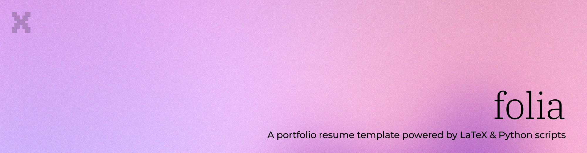

<p align="center">
  
</p>

<p align="center">
     
    <!-- <a href="https://github.com/xianmalik/xianmalik_resume/issues">
        </a> -->
    <a href="https://github.com/xianmalik/xianmalik_resume">
        </a>
    <a href="https://github.com/xianmalik/xianmalik_resume/stargazers">
        </a>
</p>

<hr />

<p align="center">
    <h2 align="center">Tech Stack</h2>
</p>

<p align="center">
    <a href="https://www.latex-project.org/"></a>
    <a href="https://tug.org/xetex/"></a>
    <a href="https://rsms.me/inter/"></a>
    <a href="https://fontawesome.com/"></a>
</p>

<hr />

<p align="center">
    <h2 align="center">Quick Start</h2>
    <small>Data-driven CV: edit YAML in <code>source/</code>, then build.</small>
</p>

```bash
# 1) Create a Python virtual environment (recommended)
python3 -m venv .venv
source .venv/bin/activate

# 2) Install generator dependencies
python3 -m pip install -r requirements.txt

# 3) Ensure XeLaTeX is available
#   macOS (MacTeX):   brew install --cask mactex # or install from tug.org
#   Linux (TeX Live): sudo apt-get install texlive-xetex texlive-fonts-recommended

# 4) Build the PDF (generates core/sections/*.tex from source/*.yml, then compiles)
python3 core/scripts/build.py

# Optional
python3 core/scripts/clean.py    # remove auxiliary files
```

<p align="center">
    <h2 align="center">Project Structure</h2>
</p>

```
├── source/                  # Source data (edit these)
│   ├── 00-summary.yml
│   ├── 10-experience.yml
│   ├── 20-projects.yml
│   ├── 30-skills.yml
│   ├── 40-education.yml
│   └── 50-languages.yml
├── core/                    # Everything needed to build the CV
│   ├── resume.tex           # Main LaTeX file
│   ├── xianmalik.cls        # Custom CV class (loads core/partials/)
│   ├── scripts/             # Build & generator scripts
│   ├── sections/            # GENERATED TeX sections (do not edit)
│   │   ├── 00-summary.tex
│   │   ├── 10-experience.tex
│   │   ├── 20-projects.tex
│   │   ├── 30-skills.tex
│   │   ├── 40-education.tex
│   │   └── 50-languages.tex
│   ├── partials/            # Modular LaTeX class partials
│   │   ├── fonts.tex
│   │   ├── layout.tex
│   │   ├── colors.tex
│   │   ├── styles.tex
│   │   ├── commands.tex
│   │   └── structure.tex
│   └── font/                # Inter & Font Awesome fonts
├── ats/                     # ATS health-check & JD-matching package
├── docs/                    # CUSTOMIZATION.md, TODO.md
├── dist/                    # Built PDF output
└── requirements.txt         # Python deps (PyYAML, watchdog)
```

<p align="center">
    <h2 align="center">Features</h2>
</p>

- **Data-driven**: Update YAML in `source/`, not TeX
- **Clean design**: Minimal, readable Inter font setup
- **One-command build**: `python3 core/scripts/build.py`
- **Safe generation**: Fails fast if data or PyYAML/XeLaTeX are missing

<p align="center">
    <h2 align="center">Requirements</h2>
</p>

- Python 3.9+ (for the YAML → TeX generator)
- PyYAML (`python3 -m pip install -r requirements.txt`)
- XeLaTeX (TeX Live or MacTeX)
- Fonts: Inter (bundled) and Font Awesome 5 (LaTeX package)

<p align="center">
    <h2 align="center">Usage</h2>
</p>

1) Edit your data only (do not edit `core/sections/*.tex`)
   - `source/00-summary.yml`
   - `source/10-experience.yml`
   - `source/20-projects.yml`
   - `source/30-skills.yml`
   - `source/40-education.yml`
   - `source/50-languages.yml`

2) Build
```bash
python3 core/scripts/build.py
```

3) Output
- PDF: `dist/resume.pdf`

<p align="center">
    <h2 align="center">Docker</h2>
</p>

No local TeX Live install required — build entirely inside Docker:

```bash
# Build the image
docker build -t folia .

# Run the build and extract the PDF into dist/
docker run --rm -v "$(pwd)/dist:/app/dist" folia

# Or use the Makefile shortcut
make docker-build
```

The PDF will be written to `dist/resume.pdf` on your host.

<p align="center">
    <h2 align="center">MCP Server</h2>
</p>

The repo ships an [MCP](https://modelcontextprotocol.io) server (`mcp/`) that gives AI coding agents access to the resume content, PDF build, and ATS flows from **any** project directory — handy for writing cover letters, portfolio pages, or project references without leaving the current workspace.

```bash
# One-time setup (installs the mcp dependency and registers user-scope)
make mcp-register

# Or run the server standalone / inside Docker
make mcp           # stdio, local venv — for testing or the MCP inspector
make mcp-docker    # stdio, containerized — repo mounted at /app, .env passed if present
```

To register the Docker variant instead of the local venv (no local Python/TeX needed beyond the image):

```bash
claude mcp add --scope user folia -- \
  docker run --rm -i -v "$(pwd):/app" --env-file "$(pwd)/.env" folia python3 mcp/server.py
```

> The image skips spaCy to stay small, so JD matching in Docker uses the LLM backend (`GROQ_API_KEY`).

Exposed tools: `get_resume`, `get_section`, `get_contact`, `list_sections`, `resume_status`, `build_resume`, `ats_health_check`, `ats_match_jd`, `list_job_descriptions`, `save_job_description`.

<p align="center">
    <h2 align="center">Customization</h2>
</p>

- **Colors**: Edit `core/partials/colors.tex` — change `accentcolor`, text colors, or the section highlight toggle
- **Fonts**: Edit `core/partials/fonts.tex` — swap font weights or replace Inter
- **Layout**: Edit `core/partials/layout.tex` — adjust margins and header/footer setup, or override in `core/resume.tex`
- **Styles**: Edit `core/partials/styles.tex` — tweak font sizes for headers, entries, and skills
- **Content**: Edit YAML in `source/` (generator writes `core/sections/*.tex`)
- See [docs/CUSTOMIZATION.md](docs/CUSTOMIZATION.md) for the full customization guide

<p align="center">
    <h2 align="center">License</h2>
</p>

<p align="center">
This project is open source and available under the <a href="LICENSE">MIT License</a>.
</p>

<p align="center">
    <h2 align="center">Author</h2>
</p>

<p align="center">
    <strong>Malik Zubayer Ul Haider</strong><br>
    <a href="https://xianmalik.com">Website</a> •
    <a href="https://github.com/xianmalik">GitHub</a> •
    <a href="https://linkedin.com/in/xianmalik">LinkedIn</a>
</p>